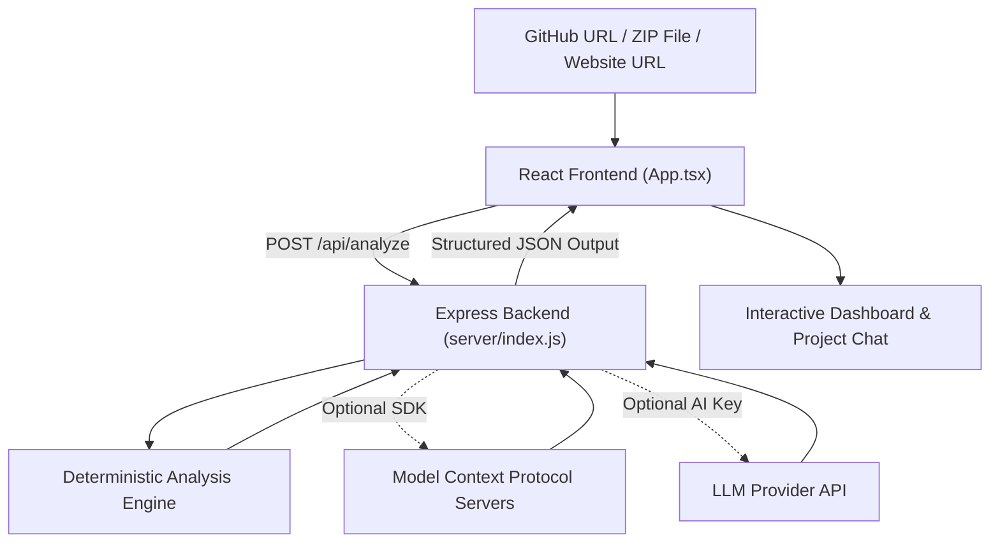

# RepoLens Project Documentation

## Project Title

RepoLens: AI-Powered Project Analysis Platform

## Project Summary

RepoLens is an AI-powered reverse engineering and project analysis platform. It helps users understand software projects by analyzing GitHub repositories, uploaded ZIP archives, and website URLs. The system inspects source files, documentation, configuration files, package manifests, API routes, architecture signals, and framework usage, then presents the results through an interactive React dashboard.

The platform also includes a project-aware chat assistant. After an analysis is generated, users can ask questions about the detected architecture, technologies, APIs, authentication flow, database signals, deployment process, and improvement opportunities.

## Objective

The main objective of RepoLens is to make unfamiliar projects easier to understand. Instead of manually reading many files and trying to identify how a project is structured, a user can provide a project source and receive a structured engineering map with summaries, diagrams, technology details, and recommendations.

## Key Features

- Analyze a GitHub repository using a public repository URL.
- Upload and inspect a ZIP archive of a project.
- Analyze website pages by fetching HTML content and extracting useful signals.
- Detect technologies from dependencies, source files, and project configuration.
- Identify frontend components, server routes, database indicators, authentication clues, and deployment setup.
- Generate architecture summaries and folder structure explanations.
- Display a Mermaid flowchart for visual understanding of the project flow.
- Show MCP pipeline status for GitHub, Fetch, Filesystem, Context7, and LLM processing.
- Use optional LLM providers to improve the quality of generated analysis.
- Provide a chat interface that answers questions based on the generated project analysis.
- Continue working with deterministic fallback analysis even when an LLM key is not configured.

## Technology Stack

| Area | Technology |
| --- | --- |
| Frontend | React 19, TypeScript, Vite |
| Styling | CSS modules/global CSS, responsive grid layouts |
| Icons | Lucide React |
| Diagrams | Mermaid |
| Backend | Node.js, Express |
| File Uploads | Multer |
| ZIP Processing | JSZip |
| MCP Integration | Official Model Context Protocol SDK |
| Configuration | dotenv, `.env`, `mcp.config.json` |
| Build Tools | TypeScript, Vite |
| Linting | oxlint |

## System Architecture

RepoLens uses a client-server architecture.




The frontend is a React dashboard built with Vite. It allows the user to choose the source type, start an analysis, view generated results across multiple tabs, inspect the MCP pipeline, and chat with the analyzed project context.

The backend is an Express server located in `server/index.js`. It exposes API endpoints for analysis, chat, and status checking. The backend handles source inspection, MCP tool calls, fallback data collection, heuristic analysis, optional Context7 documentation lookup, and optional LLM enhancement.

## Main Application Flow

1. The user selects a source type: GitHub repository, ZIP upload, or website URL.
2. The frontend sends the request to the backend through `/api/analyze`.
3. The backend inspects the selected source.
4. RepoLens extracts key evidence such as file paths, package manifests, README content, route files, website content, or archive contents.
5. The deterministic analysis engine detects architecture, technologies, folders, components, APIs, database signals, authentication signals, deployment signals, and improvement suggestions.
6. If Context7 MCP is available, the backend fetches relevant framework documentation context for detected libraries.
7. If an LLM provider is configured, the backend sends the evidence and draft analysis to the model for improved summaries and structured output.
8. The frontend displays the final analysis in a dashboard with tabs.
9. The user can ask follow-up questions through the project chat panel.

## API Endpoints

| Method | Endpoint | Purpose |
| --- | --- | --- |
| `POST` | `/api/analyze` | Accepts source details or ZIP upload and returns a structured project analysis. |
| `POST` | `/api/chat` | Accepts a user question and the current analysis object, then returns a project-aware answer. |
| `GET` | `/api/status` | Returns LLM configuration status, provider name, and model when configured. |

## Source Analysis Methods

### GitHub Repository Analysis

For GitHub repositories, RepoLens extracts the owner and repository name from the URL. It attempts to use GitHub MCP tools for repository metadata and file reading. If MCP is unavailable, it falls back to GitHub REST API calls. It reads repository metadata, the default branch tree, key files such as `README.md` and `package.json`, and then builds analysis evidence from those files.

### ZIP Archive Analysis

For uploaded ZIP projects, RepoLens loads the archive in memory with JSZip. It reads file paths and important files such as package manifests, README files, configuration files, route files, schema files, and deployment files. It can also materialize selected files into `.repolens-uploads/` for Filesystem MCP inspection.

### Website Analysis

For website URLs, RepoLens fetches the HTML content and extracts the page title, headings, script sources, links, and readable text. It can use Fetch MCP where available and falls back to native fetch when needed.

## MCP Integration

RepoLens supports multiple MCP servers through `mcp.config.json`.

- GitHub MCP is used for repository search, metadata, and file contents.
- Fetch MCP is used for website and documentation retrieval.
- Filesystem MCP is used for uploaded archive inspection.
- Context7 MCP is used to fetch up-to-date documentation for detected libraries and frameworks.

If an MCP server or tool is not available, the backend continues with fallback logic and marks the pipeline status clearly in the dashboard.

## LLM Provider Support

RepoLens supports OpenAI-compatible chat completion providers. The project can be configured with:

- OpenRouter
- xAI Grok
- Groq-hosted Llama
- OpenAI
- Ollama local models
- Any custom OpenAI-compatible API endpoint

The LLM is optional. Without an API key, RepoLens still performs deterministic analysis and shows the LLM pipeline step as pending.

## Frontend Interface

The frontend is implemented mainly in `src/App.tsx` and styled in `src/App.css`.

The interface includes:

- Source selector for GitHub, ZIP, and website inputs.
- Upload zone for project ZIP files.
- Analyze button with loading state.
- Pipeline cards showing MCP and LLM status.
- Summary metrics for architecture signals, technologies, components, and deployment hints.
- Dashboard tabs for overview, architecture, flowchart, tech stack, folders, components, data, APIs, auth, deploy, and improvements.
- Chat panel for asking questions about the analyzed project.

The UI uses a clean responsive layout, cards, tabs, status badges, and diagram rendering through Mermaid.

## Backend Analysis Logic

The backend includes several analysis functions:

- `detectTechStack` identifies technologies from dependencies, file extensions, and source text.
- `detectComponents` finds frontend component files.
- `detectApis` detects Express-style API routes and route-like files.
- `detectDatabase` searches for ORM, migration, and database references.
- `detectAuth` searches for authentication and authorization signals.
- `detectDeployment` summarizes package scripts and deployment-related files.
- `inferArchitecture` builds architecture observations from the source structure.
- `buildFlowchart` creates a Mermaid flowchart from the detected system structure.
- `buildImprovements` generates practical improvement suggestions.

This combination gives the platform useful results even before LLM enhancement is applied.

## Configuration

The project uses `.env` for server and LLM configuration.

Important configuration values include:

- `PORT`: backend server port, defaulting to `8787`.
- `GITHUB_TOKEN`: optional token for private repositories or higher GitHub API limits.
- `MCP_CONFIG_PATH`: path to the MCP configuration file.
- `OPENROUTER_API_KEY`, `XAI_API_KEY`, `GROQ_API_KEY`, `OPENAI_API_KEY`, `OLLAMA_BASE_URL`, or custom `LLM_BASE_URL` and `LLM_API_KEY`: optional LLM provider configuration.
- `LLM_MODEL`: model name used by the selected provider.

## How to Run the Project

Install dependencies:

```bash
npm install
```

Create local configuration files:

```bash
cp .env.example .env
cp mcp.config.example.json mcp.config.json
```

Start the development server:

```bash
npm run dev
```

Open the application in the browser:

```text
http://localhost:5173
```

## Build and Verification

Build the project:

```bash
npm run build
```

Run linting:

```bash
npm run lint
```

The build script runs TypeScript project builds and then creates the Vite production output.

## Project Strengths

- Supports multiple input sources instead of only one repository type.
- Combines deterministic analysis with optional AI enhancement.
- Uses MCP integrations while still providing fallback behavior.
- Presents technical findings in a structured dashboard rather than plain text only.
- Includes visual flowchart generation for easier understanding.
- Provides a project-aware chat experience after analysis.
- Keeps provider support flexible by using OpenAI-compatible API patterns.

## Current Limitations

- The analysis is based on sampled key files and detected file paths, so very large projects may not be fully inspected.
- The ZIP upload limit is set to 25 MB.
- Deep semantic code understanding depends on the available key files and optional LLM configuration.
- Authentication, database, and deployment detection are signal-based and should be verified manually for production decisions.
- MCP tools depend on local configuration and installed server availability.

## Future Enhancements

- Add export options for PDF, Markdown, or DOCX analysis reports.
- Add deeper route and dependency graph visualization.
- Support persistent analysis history.
- Add user authentication for saved projects.
- Add OpenAPI export for detected backend routes.
- Add richer project scoring for maintainability, security, and deployment readiness.
- Add comparison mode for two project versions or branches.
- Improve large repository scanning with background jobs and progress streaming.

## Conclusion

RepoLens is a practical AI-assisted project analysis platform that helps users quickly understand unfamiliar repositories, uploaded projects, and websites. It combines React, Express, MCP tools, deterministic source inspection, optional LLM enhancement, and interactive chat into one workflow. The project is useful for onboarding, code review preparation, architecture understanding, documentation generation, and technical discovery.
